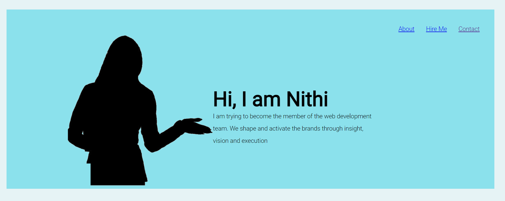

# nithi-project-website

## Personal Website

## Build With		

HTML

CSS

## HTML
* Tag Structure
	* Text Structure
	* Links
	* Other tags
		* Images
		* Title
		* Span
	* Making Things Gorgeous The Wrong Way
		* Colors
		* Width and Height
		* Borders
		* Text Styles
	* The `<head>` tag
	* Putting it all together so far

## CSS
* Classes and IDs and other Segregation
	* Classes
	* IDs
	* Other Segregation
		* The `` tag
		* The `
` tag
			* Background color
			* Flex
			* Positioning
			* Margins and Padding

## License Used

This project is licensed under the MIT License - see the [LICENSE.md](LICENSE.md) file for details

